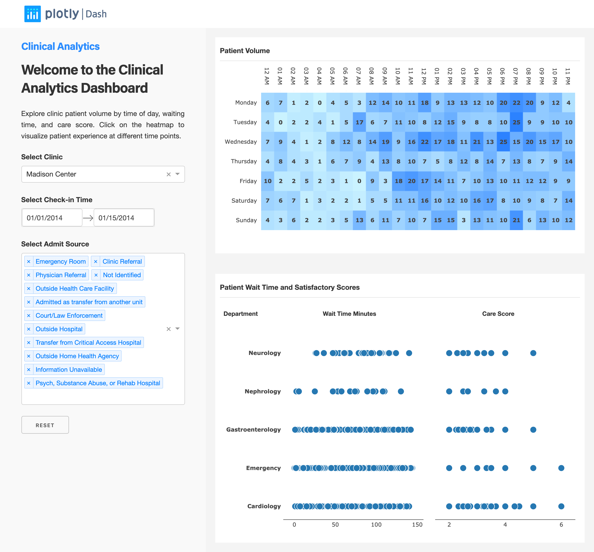

# dash-clinical-analytics

## About this app

This dashboard allows you to explore clinic patient volume by time of the day, waiting time and care score. Drill down into high-volume days to view how the busy environment may have affected patient experience.

## Requirements

* R version 3.6.0

## How to run this app

Clone the repository, and switch your directory to dashr-clinical-analytics

```
git clone https://github.com/plotly/dash-sample-apps
cd dash-sample-apps/apps/dashr-clinical-analytics

```

Install all required packages by running:
```
Rscript init.R
```

Run this app locally by:
```
Rscript app.R
```
## Snapshot 


## Resources

* [Dash](https://dash.plot.ly/)
* Inspired by [Tableau template](https://www.tableau.com/solutions/workbook/improve-patient-satisfaction-improving-cycle-time).
