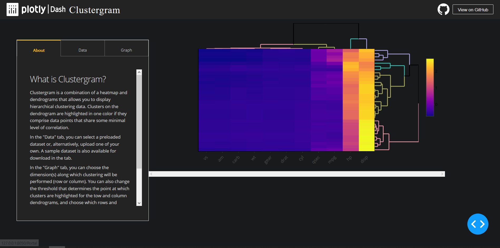

# DashR Clustergram

## About this App:

Clustergram is a combination of a heatmap and dendrograms that allows you to display hierarchical clustering data. Clusters on the dendrograms are highlighted in one color if they comprise data points that share some minimal level of correlation.

In the "Data" tab, you can select a preloaded dataset to display or, alternatively, upload one of your own. A sample dataset is also available for download in the tab.

In the "Graph" tab, you can choose the dimension(s) along which clustering will be performed (row or column). You can also change the threshold that determines the point at which clusters are highlighted for the row and column dendrograms, and choose which rows and columns are used to compute the clustering.

In addition, you can highlight specific clusters by adding annotations to the clustergram, and choose whether to show or hide the labels for the rows and/or columns.

Github Repo: [plotly/dash-sample-apps](https://github.com/plotly/dash-sample-apps/)

## How to Run the App: 

Clone the repository.

Run `app.R`

The app will load into your default browser window. If it does not, navigate to 127.0.0.1:8050.

## Screenshots:

## More:

Learn more about Plotly and Dash [here](https://plot.ly/dash).
#
