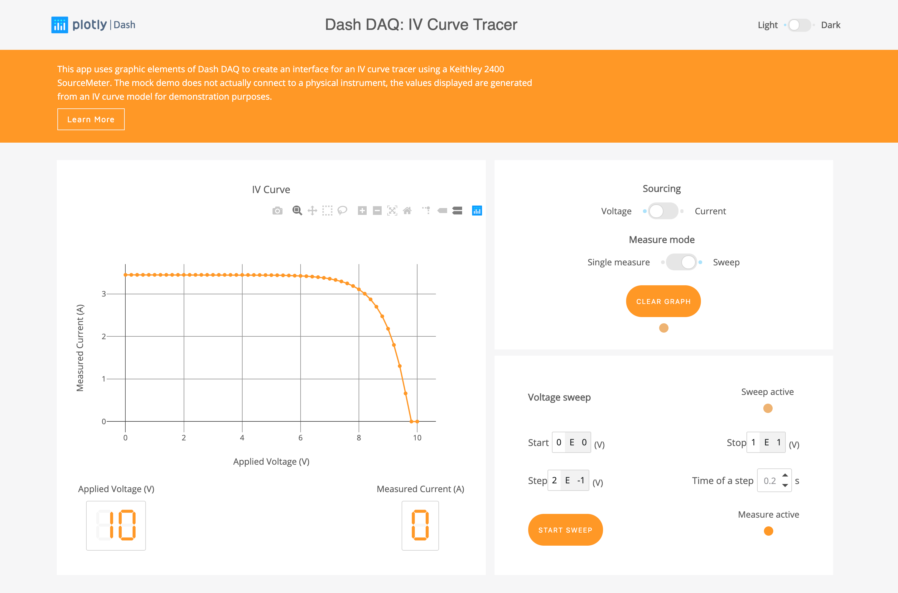
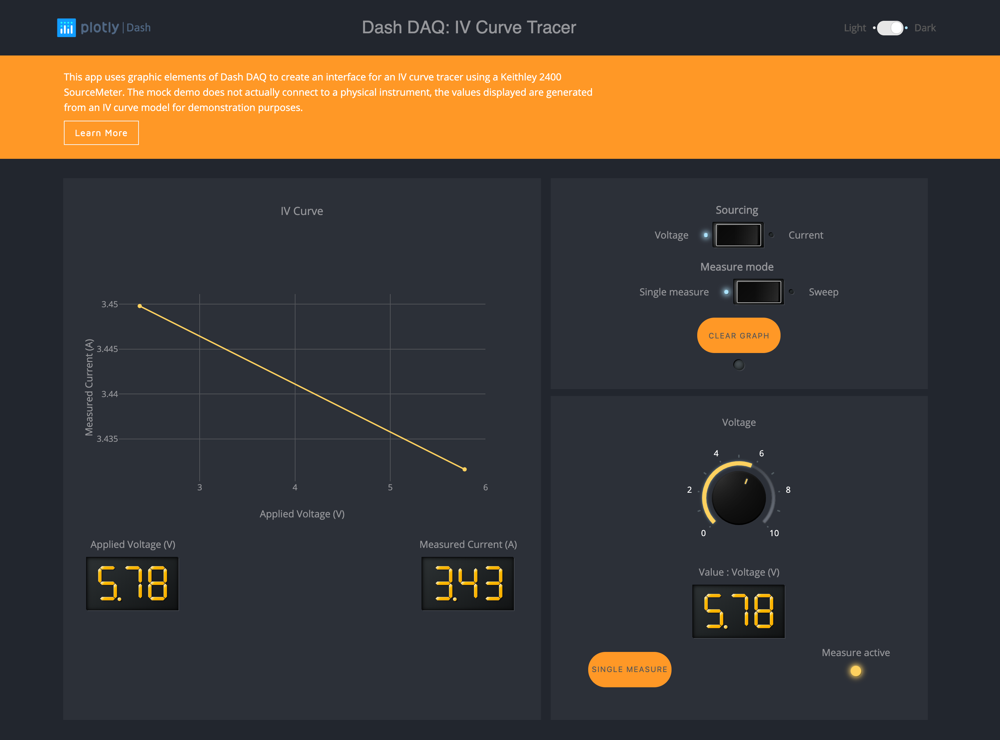
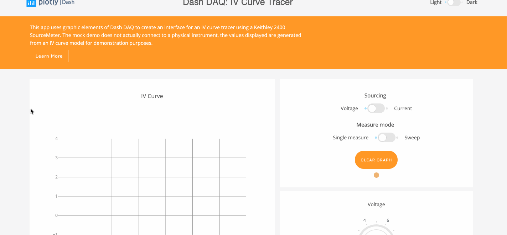

# DashR DAQ IV Curve Tracer

Dash abstracts away all of the technologies and protocols required to build an interactive web-based application, and
is a simple and effective way to bind a user interface around your R or Python code. To learn more about Dash, check out our
[documentation](https://dashr.plot.ly/).

## About the app

`dashr-daq-iv-tracer` uses the graphic elements of Dash DAQ to create an interface for acquiring current-voltage I-V curves with a Keithley 2400 SourceMeter.
[Try this demo app](https://github.com/plotly/dash-sample-apps/tree/master/apps/dashr-daq-iv-tracer) on the Dash Deployment Server.

Also, you can access the Python version in the [Dash Gallery](https://dash-gallery.plotly.host/dash-daq-iv-tracer/).
### IV Curves

I-V curve is a good way to characterize electronic components (diode, transistor or solar cells) and extract their operating properties. It is widely used in electrical engineering and physics.
The Keithley 2400 SourceMeter provides precision voltage and current sourcing as well as measurement.

### dashr-daq

[Dash-DAQ](https://www.dashdaq.io/) is a data acquisition and control package built on top of Plotly's
[Dash](https://plot.ly/products/dash/). It comprises a robust set of controls that make it simpler to integrate data
acquisition and controls into your Dash applications.

## Getting Started

### Controls

- Single measurement mode: Adjust the value of the source with the knob at the bottom of the graph area and click on the `Single Measure` button, the measured value will be displayed. Repetition of this procedure for different source values will reveal the full IV curve.

- Sweep mode: Set the sweep parameters `start`, `stop` and `step` as well as the time spent on each step, then click on the button `Start Sweep`, the result of the sweep will be displayed on the graph. The data is never erased unless the button `Clear Graph` is pressed, or if the source type is changed.

- Dark/light theme: Click on theme toggle on top of the page to view dark/light layout.

### Running the app locally

Clone the git repo:

```
git clone https://github.com/plotly/dash-sample-apps
cd dash-sample-apps/apps/dashr-daq-iv-tracer
```

Run `Rscript init.R` to install all of the required packages

Run `Rscript app.R`:

The app should automatically open in your default browser. If it does not, navigate to 127.0.0.1:8050. You should see something like this: 


## Screenshots








