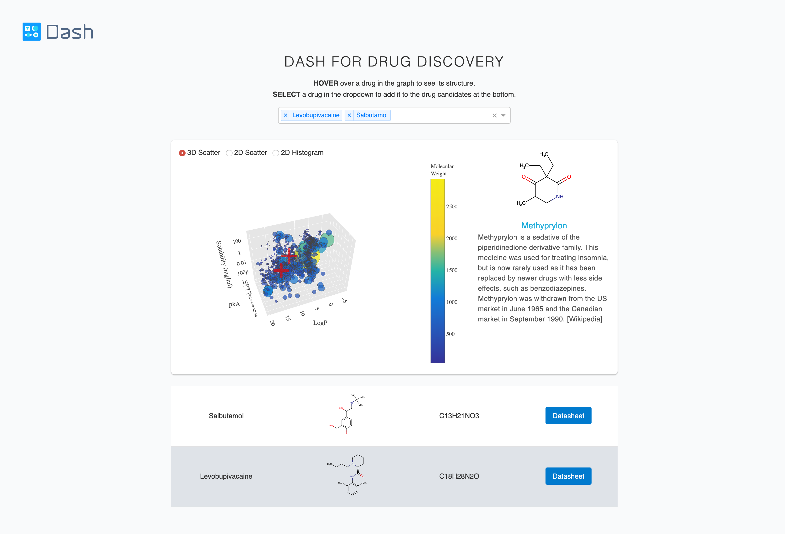

# Dash Drug Discovery

## About this app

This demo allows users to compare and explore different drug properties by selecting on the dropdown menu.

Original repo: [plotly/dash-drug-discovery-demo](https://github.com/plotly/dash-drug-discovery-demo)

## How to run this app

First, clone this repository and open a terminal inside the root folder:
`git clone https://github.com/plotly/dash-sample-apps.git`
`cd dash-sample-apps/apps/dashr-drug-discovery`

Install packages (using `install.packages('PACKAGE NAME')`) that are listed in app.R

Run the app (from your terminal):

 `Rscript app.R`
 
Open a browser at http://127.0.0.1:8050

## Screenshots

## Resources

- To learn more about Dash, check out our [documentation](https://plot.ly/dash).

