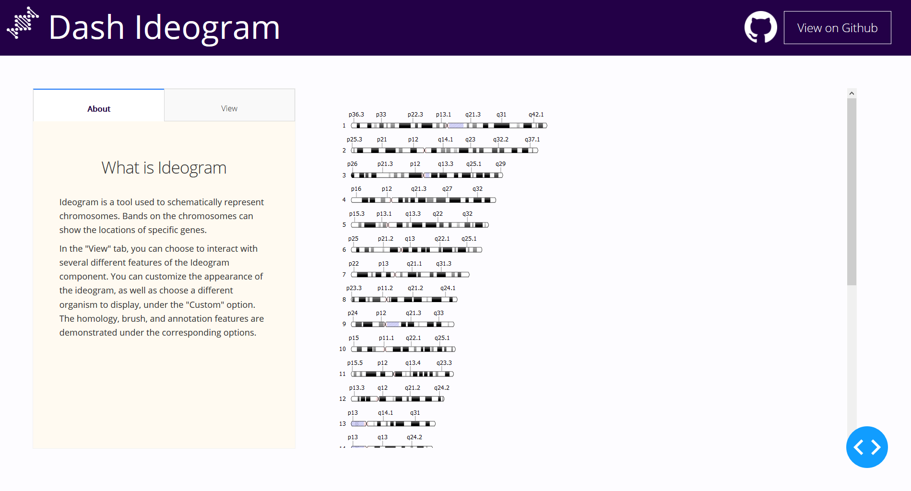
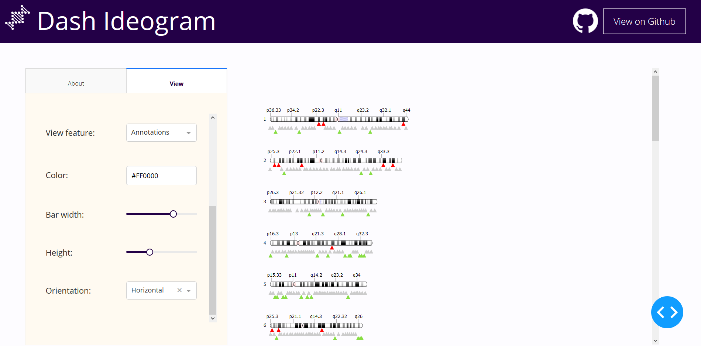

# DashR Ideogram 

## About this App:

This is an interactive, chromosome viewer which displays the chromosomes of various species imported from the NCBI Taxonomy database. The interface allows you to view four different features, a custom plot with user-selectable BPHS, labelling and zoom functions, a homology feature which compares areas of two chromosomes, an annotation feature which plots annotation data onto the chromosomes, and a brush function to highlight and select areas of the chromosomes. 

Github Repo: [plotly/dash-sample-apps](https://github.com/plotly/dash-sample-apps/)

## How to Run the App: 

Clone the repository.

Run `app.R`

The app will load into your default browser window. If it does not, navigate to 127.0.0.1:8050.

## Screenshots:

## More:

Learn more about Plotly and Dash [here](https://plot.ly/dash).
#
