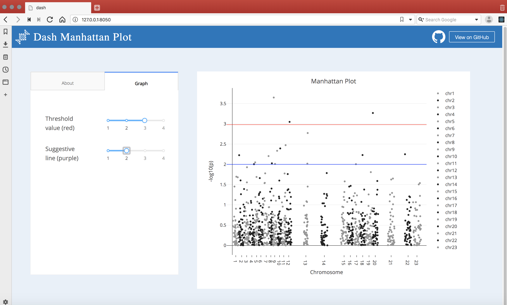

# DashR Manhattan Plot

## About this App:

Manhattan Plot allows you to visualize genome-wide association studies (GWAS) efficiently. Using WebGL under the hood, you can interactively explore overviews of massive datasets comprising hundreds of thousands of points at once, or take a closer look at a small subset of your data

You can adjust the threshold level and the suggestive line in the "Graph" tab.      

Github Repo: [plotly/dash-sample-apps](https://github.com/plotly/dash-sample-apps/)

## How to Run the App: 

Clone the repository.

Run `app.R`

The app will load into your default browser window. If it does not, navigate to 127.0.0.1:8050.

## Screenshots:

## More:

Learn more about Plotly and Dash [here](https://plot.ly/dash).
#

