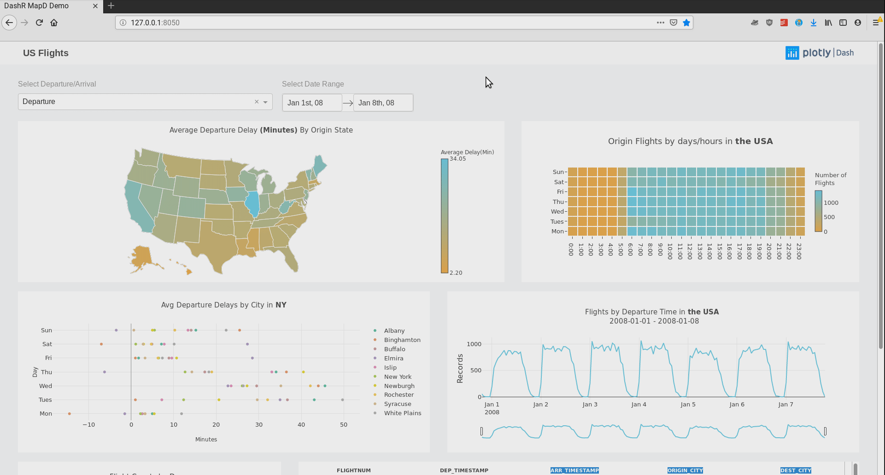

# DashR Mapd Demo 

## About this app:
This Dash app updates real-time visual analytics by constantly querying a remote Omnisci (MapD) SQL Engine. 

## About this dataset

The public dataset used in this app, "flight_2008_7M", includes every single record of US airline flights known by the Bureau of Transportation Statistics in the year 2008. By default, it can be loaded from the `insert_sample_data` script during the Omnisci server installation.

## Requirements

* R, with the following packages:
  - [dash](https://github.com/plotly/dashR)
  - plotly
  - fasttime
  - [RJDBC](https://www.omnisci.com/docs/latest/6_rjdbc.html) (to query from OmniSci) 
* Omnisci server installation: [Guide to install Omnisci](https://www.omnisci.com/docs/latest/4_docker.html) 

## How to Run the App 

Clone the git repo:

```
git clone https://github.com/plotly/dash-sample-apps
cd dash-sample-apps/apps/dashr-mapd-demo
```

Run `app.R`:

The app will load into your default browser window. If it does not, navigate to 127.0.0.1:8050.

Click on individual state from choropleth map to visualize state-specific flight delays in other plots and datatable, drag along time-series, click on 
single bar or drag along scatters to know flight details in the table. 

## Screenshots:



## Resources

* [Dash](https://dash.plot.ly/)
* [Omnisci Core](https://www.omnisci.com/platform/core)
* [PymapD Python Client](https://pymapd.readthedocs.io/en/latest/)
* Inspired by [Omnisci Demo app](https://www.omnisci.com/demos/flights/#/dashboard/4?_k=ks7460).
