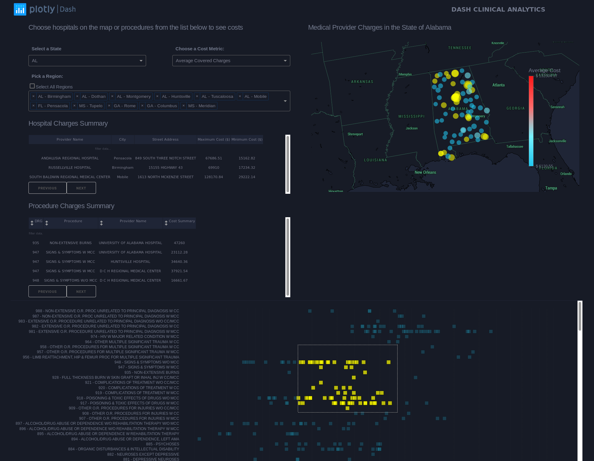

# DashR Medical Provider Charges

## About this app

This app creates a dashboard to visualize medical provider charges/costs from US hospitals and clinics.

Data are downloaded from open data platform by [Centers for Medicare & Medicaid Services](https://www.cms.gov/Research-Statistics-Data-and-Systems/Statistics-Trends-and-Reports/Medicare-Provider-Charge-Data/Inpatient2016.html).  
This dataset covers national and state summary of inpatient charges in Fiscal Year 2016. Information includes utilization, payment(total and medicare payment), hospital-specific charges for all medicare-certified hospital facilities.

Detailed explanation on columns could be found [here](https://data.cms.gov/Medicare-Inpatient/Inpatient-Prospective-Payment-System-IPPS-Provider/fm2n-hjj6)



### Running the app locally
Clone the git repo

```
git clone https://github.com/plotly/dash-sample-apps
cd dash-sample-apps/apps/dashr-medical-provider-charges
```

Run the app. From the terminal, run:
```
Rscript app.R
```

Open a browser at http://127.0.0.1:8050


