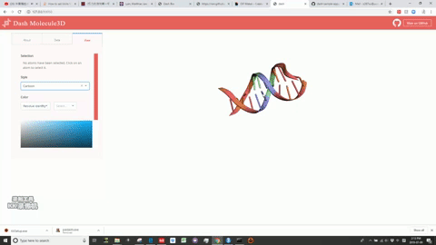

# dashr-molecule3d
# Molecule3d

This is a Dash for R version of the [molecule3d](https://github.com/plotly/dash-bio/blob/master/tests/dashbio_demos/app_molecule3d.py) app previously written in Python.

## Screenshots


## About this app:

Molecule3D is a visualizer that allows you to view biomolecules in multiple representations: sticks, spheres, and cartoons. "pdb" files 
are required for the database.

### Using the demo

#### Running the app locally

Clone the `git` repo and `cd` to the root directory:

```
git clone https://github.com/plotly/dash-sample-apps
cd dash-sample-apps/apps/dashr-molecule3d
```
Launch R, then install the required package dependencies in the default location:

```

remotes::install_github("plotly/dash-html-components")
remotes::install_github("plotly/dash-core-components")
remotes::install_github("plotly/dash-table")
remotes::install_github("plotly/dashR")
remotes::install_github("plotly/dash-daq")
remotes::install_github("plotly/dash-bio")

install.packages("bio3d")
install.packages("jsonlite")
```

Run the app, either interactively in R or RStudio, or by using the command line:

```
Rscript app.R
```

Finally, open your browser and enter the URL http://127.0.0.1:8050. 

