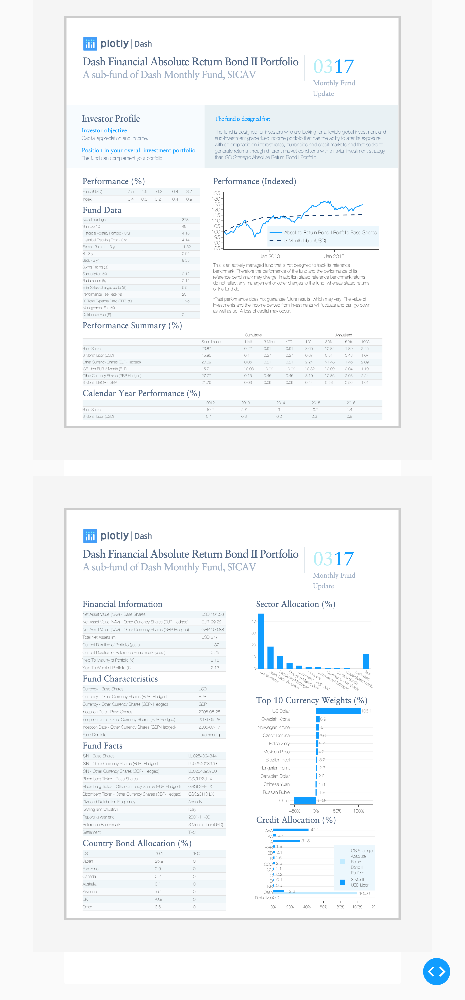

**Dashr Monthly Fund Report Demo**

This is a demo of the Dash interactive R framework developed by [Plotly](https://plot.ly/).

Dash abstracts away all of the technologies and protocols required to build an interactive web-based application and is a simple and effective way to bind a user interface around your R or Python code.

To learn more check out our [documentation](https://plot.ly/dash).

To run this app locally:

1 - Clone the git repo:

```
git clone https://github.com/plotly/dash-sample-apps
cd dash-sample-apps/apps/dashr-monthly-fund-report
```

2 - Run `Rscript init.R` to install all of the required packages

3 - Run `Rscript app.R`:

The following are screenshots for the app in this repo:


