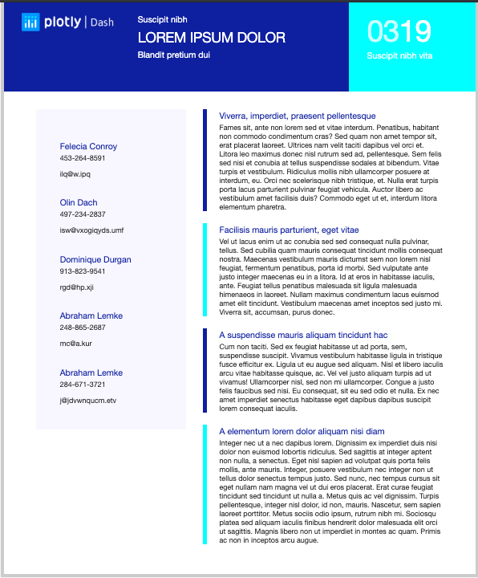

# dashr-multipage-report
# Multi Page Report

This is a dash for R version of the multipage report app written in python

## Screenshots


## About this app:

This app is a full multipage report it provides figures with inline text and graphs.

### Using the demo

#### Running the app locally

Clone the git repo and change to the root directory 

```
git clone https://github.com/plotly/dash-sample-apps
cd dash-sample-apps/apps/dashr-multipage-report
```
Install the requirements. From the terminal, run the following to install the required packages in the default location:

```
R -e "install.packages(c("random", "generator", "stringi", "dashTable", "data.table", "plotly"))"
```

Run the app. From the terminal, run:

```
Rscript app.R
```

Open a browser at http://127.0.0.1:8050


