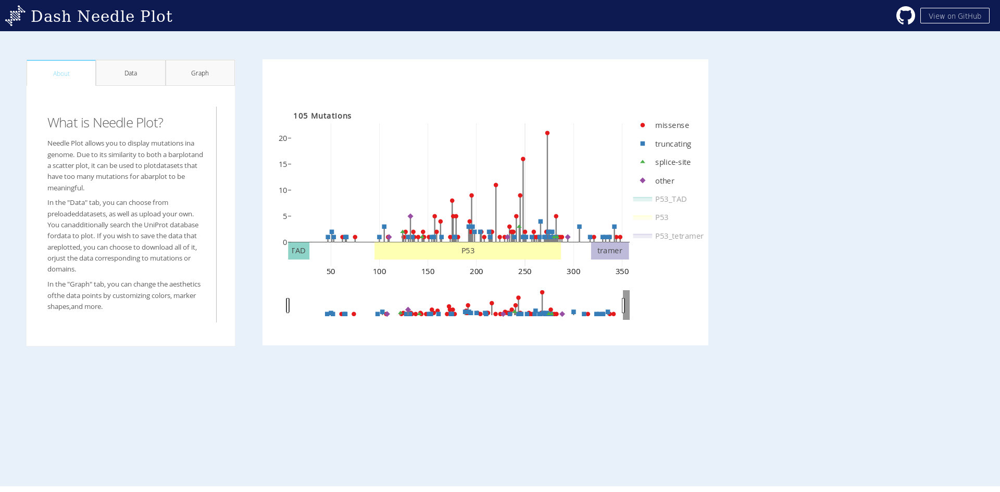

# dashr-needleplot 

Needle Plot allows you to display mutations in a genome. Due to its similarity to both a barplot and a scatter plot, it can be used to plot datasets that have too many mutations for a barplot to be meaningful.

In the "Data" tab, you can choose from preloaded datasets, as well as upload your own. You can additionally search the UniProt database for data to plot. If you wish to save the data that are plotted, you can choose to download all of it, or just the data corresponding to mutations or domains.

In the "Graph" tab, you can change the aesthetics of the data points by customizing colors, marker shapes, and more.



## About this app:
### Using the demo

### Running the app locally
Clone the git repo

```
git clone https://github.com/plotly/dash-sample-apps
cd dash-sample-apps/apps/dashr-needleplot
```

Install the requirements. From the terminal, run the following to install the required packages in the default location:
```
R -e "install.packages(c("ape"))"
```

Run the app. From the terminal, run:
```
Rscript app.R
```

Open a browser at http://127.0.0.1:8050


