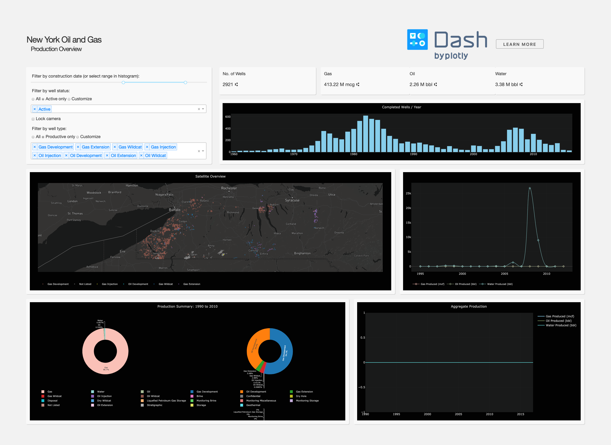

# Dash Oil and Gas Demo

## About this App:

This is an interactive dash app that allows users to select gas well types and regions. 

Github Repo: [plotly/dash-sample-apps](https://github.com/plotly/dash-sample-apps/)

## How to Run the App: 

Clone the repository.

Run `app.R`
Or `Rscript app.R` in Terminal or Command Line. 

The app will load into your default browser window. If it does not, navigate to 127.0.0.1:8050.

## Screenshots:

## More:

Learn more about Plotly and Dash [here](https://plot.ly/dash).
##

