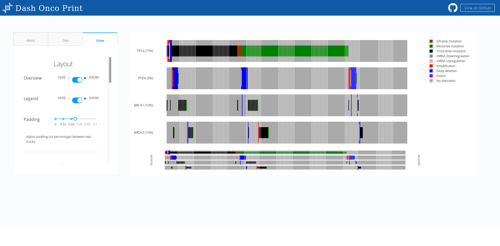

# DashR Onco Print 

## About this app:

The OncoPrint component is used to view multiple genomic alteration events through an interactive and zoomable heatmap. It is a React/Dash port of the popular `oncoPrint()` function from the Bioconductor R package. Under the hood, the rendering is done with D3 via Plotly.js. Plotly's interactivity allows you to bind clicks and hovers to genetic events, letting you create complex bioinformatics apps or workflows that leverage crossfiltering.

Read more about the component [here](https://github.com/plotly/react-oncoprint).

## How to Run the App 

Clone the git repo:

```
git clone https://github.com/plotly/dash-sample-apps
cd dash-sample-apps/apps/dashr-oncoprint
```

Run `app.R`:

The app will load into your default browser window. If it does not, navigate to 127.0.0.1:8050.

## Screenshots:



