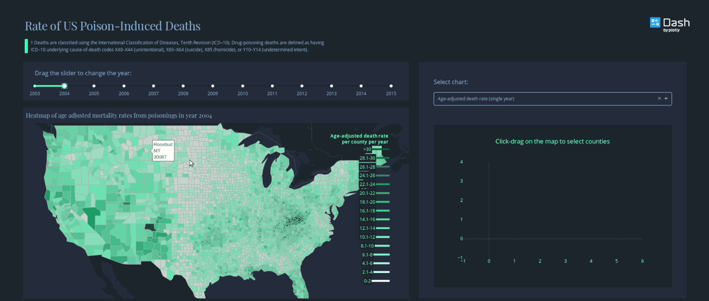

# dashr-opioid-endemic



# Opioid Endemic

This is a dash for R version of the Opioid Endemic app written in python [Opioid Endemic](https://github.com/plotly/dash-sample-apps/tree/master/apps/dash-opioid-endemic)

## Screenshots

## About this app:

This app visualizes the opioid endemic in the US visualization is done by selecting region and then selecting a plot type (number of deaths in a selected year or all years, age adjusted death rate in a selected year or all years). 

Poison induced death data was downloaded from CDC Wonder, using cause-of-death codes X40–X44 (unintentional), X60–X64 (suicide), X85 (homicide), or Y10–Y14 (undetermined intent

### Using the demo

#### Running the app locally

Clone the git repo and change to the root directory 

```
git clone https://github.com/plotly/dash-sample-apps
cd dash-sample-apps/apps/dashr-opioid-endemic 
```
Install the requirements. From the terminal, run the following to install the required packages in the default location:

```
R -e "install.packages(c("dash", "dplyr", "stringr", "glue", "data.table", "plotly", "tidyr"))"
```

Run the app. From the terminal, run:

```
Rscript app.R
```

Open a browser at http://127.0.0.1:8050


