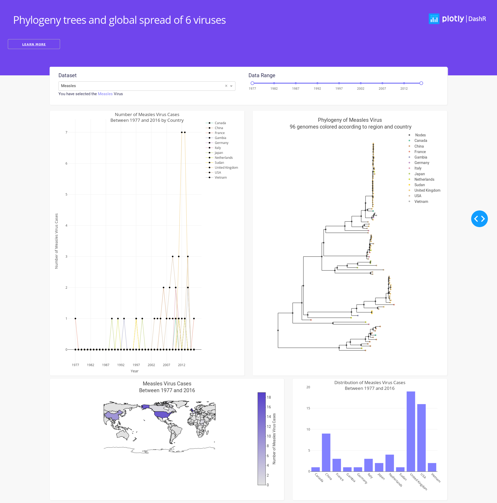

# dashr phylogeny

## About this app:
### Using the demo
This demo lets you interactively explore the phylogeny and spread of selected diseases. Select a disease from the "Dataset" dropdown, and the date range you want from the "Data Range" slider, and it will display:

- A line plot of the number of cases per country, per year
- The phylogenetic tree of the disease
- A map showing the number of cases per country
- A histogram of the distribution of cases by country



### Running the app locally
Clone the git repo

```
git clone https://github.com/plotly/dash-sample-apps
cd dash-sample-apps/apps/dashr-phylogeny 
```

Install the requirements. From the terminal, run the following to install the required packages in the default location:
```
R -e "install.packages(c('ape'))"
```

Run the app. From the terminal, run:
```
Rscript app.R
```

Open a browser at http://127.0.0.1:8050

