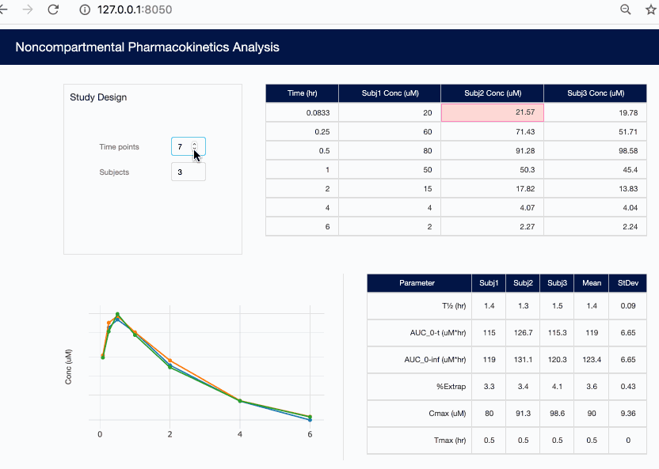

# PKcalc

## About this app

This app calculates pharmacokinetic parameters from entered plasma
concentrations for up to 48 subjects.

### Noncompartmental Pharmacokinetics Analysis (NCA)

Noncompartmental pharmacokinetics is typically used to analyze data from
small animal studies during the lead optimization phase of drug discovery.
These studies are used to help predict human dosing and plan safety studies.

## How to run this app

To run this app first clone repository and then open a terminal to the app folder.

```
git clone https://github.com/plotly/dash-sample-apps.git
cd dash-sample-apps/apps/dashr-pk-calc
```

Install the requirements:

```
Rscript init.R
```

Run the app:

```
Rscript app.R
```
You can run the app on your browser at http://127.0.0.1:8050

## Screenshots



## Notes:
* AUC values are calculated using the trapezoid rule on non-logged
concentrations.
* The AUC calculation includes t=0, even if no concentration is entered, in which
case the concentration is assumed to be zero.
* The terminal elimination rate, used to determine t<sub>1/2</sub> and
AUC<sub>0-inf</sub>, is calculated from the final three time points.    

## Resources

To learn more about Dash, please visit [documentation](https://dashr-docs.herokuapp.com/).


