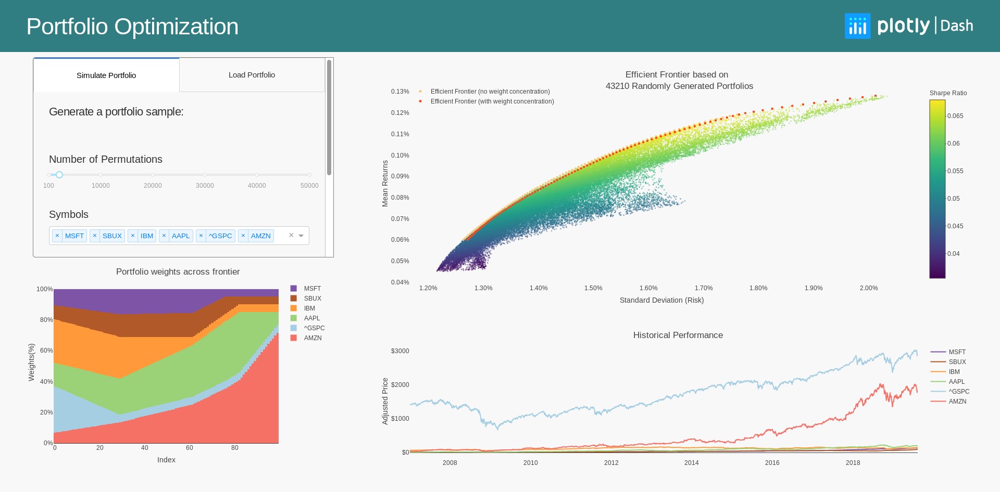

# Portfolio Optimization with Dash for R

## Introduction:

This app visualizes portfolio optimization in R, relying on the `PortfolioAnalytics` and `PerformanceAnalytics` packages. Several portfolios are pre-generated and can be loaded via the `Load Portfolio` tab, or a new set of random portfolios can be generated using the `Simulate Portfolio` tab. Note that generating a random portfolio is time consuming, and relies on the `random_portfolios` function from `PortfolioAnalytics`.

This app was inspired by the [Portfolio Optimization using R and Plotly](https://moderndata.plot.ly/portfolio-optimization-using-r-and-plotly/) blog post on modern data.

## Screenshots:

