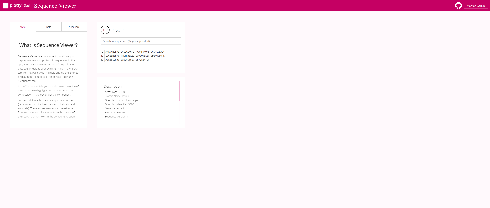

# DashR Sequence Viewer 

## About this App:

Sequence Viewer is a component that allows you to display genomic and proteomic sequences.. More information about the component is available [here](https://github.com/plotly/react-sequence-viewer)

## How to Run the App

Clone the repository:

```
git clone https://github.com/plotly/dash-sample-apps
cd dash-sample-apps/apps/dashr-sequence-viewer
```

Run `app.R`

The app will load into your default browser window. If it does not, navigate to 127.0.0.1:8050.

## Screenshots



## More

Learn more about Plotly and Dash [here](https://plot.ly/dash).
