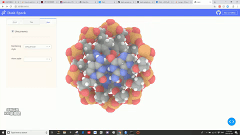

# DashR Speck 

This is a Dash for R version of the [Speck app](https://github.com/plotly/dash-bio/blob/master/tests/dashbio_demos/app_speck.py) originally written in Python.

## Screenshots


## About this app:

Speck is a WebGL-based molecule renderer. By using ambient occlusion, the resolution of the rendering does not suffer as you zoom in. "xyz" files are required for the database.

### Using the demo

#### Running the app locally

Clone the git repo and change to the root directory 

```
git clone https://github.com/plotly/dash-sample-apps
cd dash-sample-apps/apps/dashr-speck
```
Install the requirements. From the terminal, run the following to install the required packages in the default location:

```
remotes::install_github("plotly/dashR", ref="0.1.0-cran")
remotes::install_github("plotly/dash-html-components", ref="1.0.0-cran")
remotes::install_github("plotly/dash-core-components", ref="1.0.0-cran")
remotes::install_github("plotly/dash-daq", ref="update-for-dash-0.1.0")
remotes::install_github('plotly/dash-bio', ref="update-for-dash-0.1.0")
remotes::install_github('plotly/dash-table')
```

Run the app. From the terminal, run:

```
Rscript app.R
```

Open a browser at http://127.0.0.1:8050

