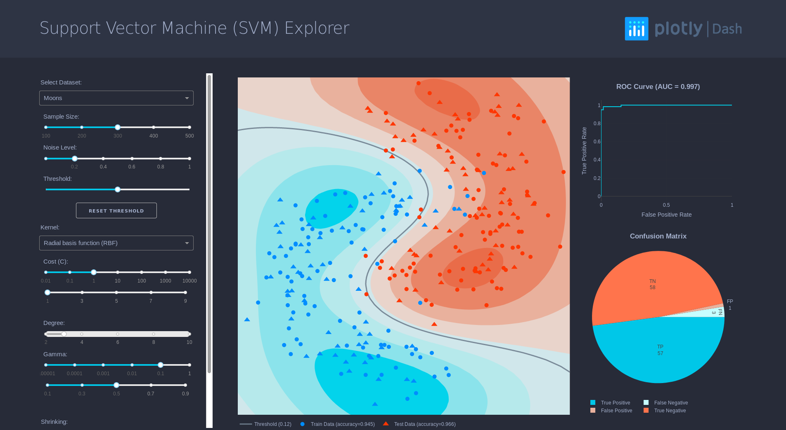

# dashr-svm
# Support Vector Machine (SVM) Explorer

This is a dash for R version of the [SVM Explorer written in python](https://github.com/plotly/dash-sample-apps/tree/master/apps/dash-svm)



## About this app:
### Using the demo
This demo lets you interactive explore Support Vector Machine (SVM). 

It includes a few artificially generated datasets that you can choose from the dropdown, and that you can modify by changing the sample size and the noise level of those datasets.

The other dropdowns and sliders lets you change the parameters of your classifier, such that it could increase or decrease its accuracy.

### Running the app locally
Clone the git repo

```
git clone https://github.com/plotly/dash-sample-apps
cd dash-sample-apps/apps/dashr-svm 
```

Install the requirements. From the terminal, run the following to install the required packages in the default location:
```
R -e "install.packages(c("dash", "caret", "ROCR", "e1071", "data.table"))"
```

Run the app. From the terminal, run:
```
Rscript app.R
```

Open a browser at http://127.0.0.1:8050


