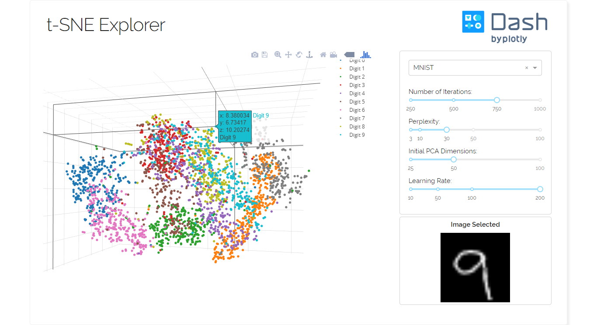

# dashr-tsne
## t-SNE Explorer
This is a dash for R version of the [t-SNE Explorer app written in python](https://github.com/plotly/dash-sample-apps/tree/master/apps/dash-tsne)



## About this app:
### Using the demo
To get started, choose a dataset you want to visualize. When the scatter plot appears on the graph, you can see the original image by clicking on a data point. 

Alternatively, you can explore the GloVe Word Vectors datasets, which are encoded vectors of large collection of texts from Wikipedia, Twitter, and acquired through Web Crawlers. Upon clicking a data point, you will be able to see the 5 closest neighbors of the word you clicked.

### What is t-SNE?
t-distributed stochastic neighbor embedding, created by van der Maaten and Hinton in 2008, is a visualization algorithm that reduce a high-dimensional space (e.g. an image or a word embedding) into two or three dimensions, facilitating visualization of the data distribution. 

A classical example is MNIST, a dataset of 60,000 handwritten digits, 28x28 grayscale. Upon reducing the set of images using t-SNE, you can see all the digit clustered together, with few outliers caused by poor calligraphy. [You can read a detailed explanation of the algorithm on van der Maaten's personal blog.](https://lvdmaaten.github.io/tsne/)


### Running the app locally
Clone the git repo

```
git clone https://github.com/plotly/dash-sample-apps
cd dash-sample-apps/apps/dashr-tsne
```

Install the requirements. From the terminal, run the following:
```
Rscript init.R
```

Run the app. From the terminal, run:
```
Rscript app.R
```

Open a browser at http://127.0.0.1:8050

