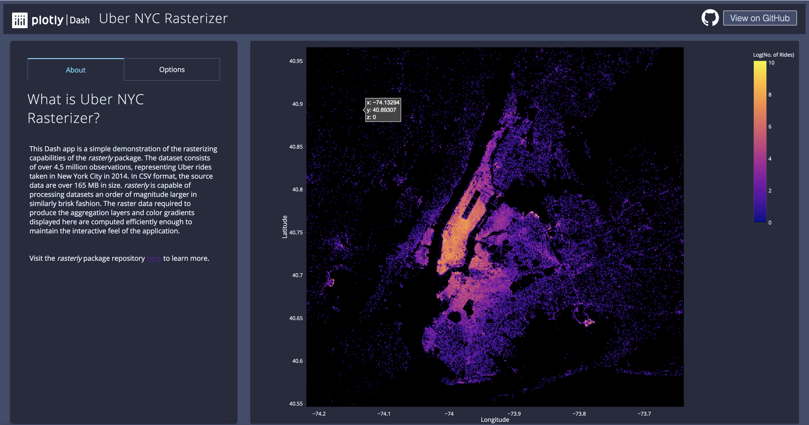

# DashR Uber Rasterizer

## About this App:

This Dash app is a simple demonstration of the rasterizing capabilities of the rasterly package. The dataset consists of over 4.5 million observations, representing Uber rides taken in New York City in 2014. In CSV format, the source data are over 165 MB in size. rasterly is capable of processing datasets an order of magnitude larger in similarly brisk fashion. The raster data required to produce the aggregation layers and color gradients displayed here are computed efficiently enough to maintain the interactive feel of the application.

## How to Run the App

Clone the repository:

```
git clone https://github.com/plotly/dash-sample-apps
cd dash-sample-apps/apps/dashr-uber-rasterizer
```

Run `app.R`

The app will load into your default browser window. If it does not, navigate to 127.0.0.1:8050.

## Screenshots



## More

Learn more about Plotly and Dash [here](https://plot.ly/dash).
