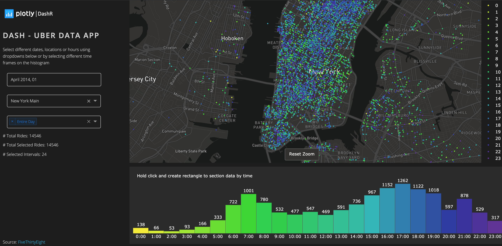
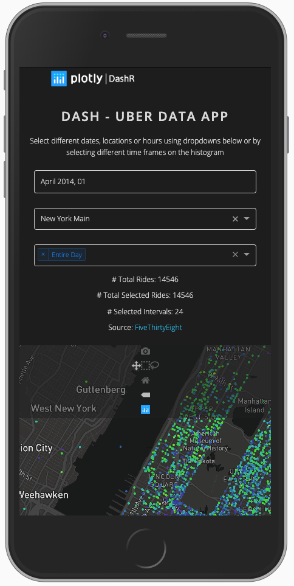

# Dash Uber Rides Demo

**About this app**

This is a demo of the Dash interactive R framework developed by [Plotly](https://plot.ly/).
Dash abstracts away all of the technologies and protocols required to build an interactive web-based application and is a simple and effective way to bind a user interface around your R code.

This demo is based off of data provided by [FiveThirtyEight](https://github.com/fivethirtyeight/uber-tlc-foil-response/tree/master/uber-trip-data) and highlights Uber trips taken in New York City from April 2014 to September 2014.

**How to run this app**

To run this app first clone repository and then open a terminal to the app folder.

```
git clone https://github.com/plotly/dash-sample-apps.git
cd dash-sample-apps/apps/dashr-uber-rides-demo
```

Install the requirements:

```
Rscript init.R
```

Run the app:

```
Rscript app.R
```
You can run the app on your browser at http://127.0.0.1:8080


**Screenshots**





**Resources**

To learn more about Dash, please visit [documentation](https://dashr-docs.herokuapp.com/).

