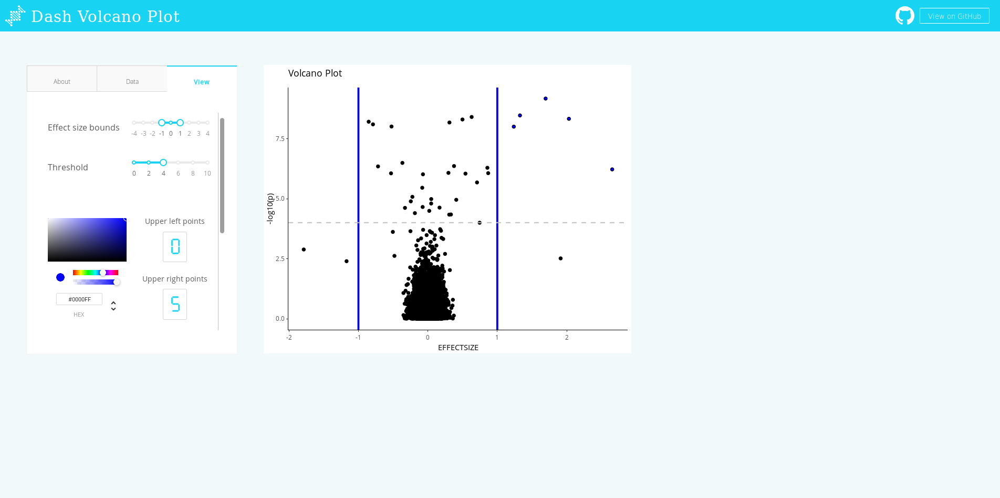

# DashR Volcano Plot 

## About this App:

This is an interactive (volcanoplot)[https://en.wikipedia.org/wiki/Volcano_plot_(statistics)] viewer, allowing the user to identify clinically meaningful markers in genomic experiments, i.e., markers that are statistically significant and have an effect size greater than some threshold.

In the "Data" tab, you can select a dataset to view on the plot. In the "View" tab, you can control the color of the highlighted points, as well as the threshold lines that define which values are significant. You can also access metadata from hovering and clicking on the graph.

Github Repo: [plotly/dash-sample-apps](https://github.com/plotly/dash-sample-apps/)

## How to Run the App: 

Clone the repository.

Run `app.R`

The app will load into your default browser window. If it does not, navigate to 127.0.0.1:8050.

## Screenshots:

## More:

Learn more about Plotly and Dash [here](https://plot.ly/dash).
#

