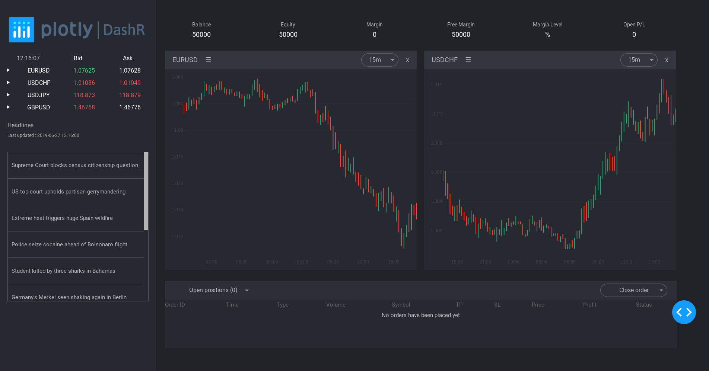

# dashr-web-trader

## Forex trading dashboard

This is a dash for R version of the [web trader app written in python](https://github.com/plotly/dash-sample-apps/tree/master/apps/dash-web-trader)



## About this app:
### Using the demo
This demo lets you explore historical forex major pairs ticks data from Pepperstone.

The left panel displays ask and bid prices for each pair by reading the dataset on interval updates. If you click on the row, you see that you can also add charts or buy/sell pairs.

You can also visualize market prices with candlesticks, line, OHLC bars and make some studies on it with the selected period in the dropdown. You can choose these options in the graph div menu by clicking on ☰ .

Finally, top news articles from BBC are displayed on the left and updated on interval updates, using https://newsapi.org/


### Running the app locally
Clone the git repo

```
git clone https://github.com/plotly/dash-sample-apps
cd dash-sample-apps/apps/dashr-web-trader
```

Install the requirements. From the terminal, run the following to install the required packages in the default location:
```
R -e "install.packages(c('xts', 'fasttime'))"
```

Run the app. From the terminal, run:
```
Rscript app.R
```

Open a browser at http://127.0.0.1:8050


