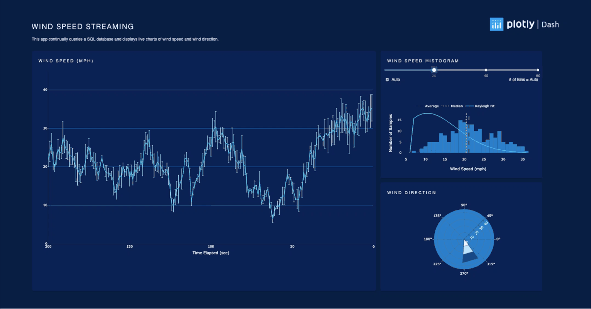

# dashr-wind-streaming
# Wind streaming

This is a dash for R version of the Wind Streaming app written in python [Wind Streaming](https://github.com/plotly/dash-sample-apps/tree/master/apps/dash-wind-streaming)

## Screenshots


## About this app:

This app queries a SQL database every second and uses the data to update the wind speed diagram and the wind direction diagram. 

The wind speed values are then binned in real time to generate the wind histogram plot.

### Using the demo

#### Running the app locally

Clone the git repo and change to the root directory 

```
git clone https://github.com/plotly/dash-sample-apps
cd dash-sample-apps/apps/dashr-wind-streaming 
```
Install the requirements. From the terminal, run the following to install the required packages in the default location:

```
R -e "install.packages(c("dash", "DBI", "RSQLite", "stringr", "glue", "data.table", "plotly", "VGAM"))"
```

Run the app. From the terminal, run:

```
Rscript app.R
```

Open a browser at http://127.0.0.1:8050


