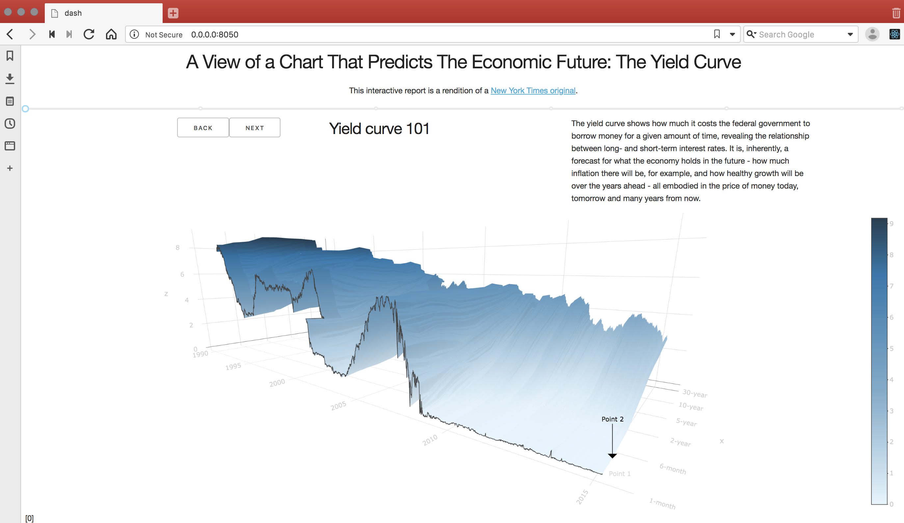

**Dash Yield Curve App**

This is a demo of the Dash interactive Python framework developed by [Plotly](https://plot.ly/).

Dash abstracts away all of the technologies and protocols required to build an interactive web-based application and is a simple and effective way to bind a user interface around your Python code.

This Dash app adapts the excellent [NY Times report A 3-D View of a Chart That Predicts The Economic Future: The Yield Curve](https://www.nytimes.com/interactive/2015/03/19/upshot/3d-yield-curve-economic-growth.html).

To learn more check out our [documentation](https://plot.ly/dash).

## Screenshot:

