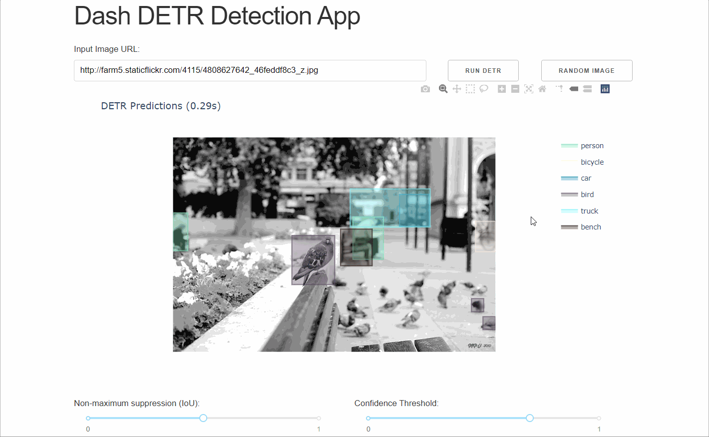

# Dash DETR Detection App

*A User Interface for DETR built with Dash. 100% Python. [Click here for a demo](https://dash-gallery.plotly.host/dash-detr/).*

The release of [*DETR: End-to-End Object Detection with Transformers*](https://github.com/facebookresearch/detr) showed significant improvement in real-time object detection and panoptic segmentation (PS), while greatly simplifying the architecture. As a mean to test the model, we decided to build a simple [Dash](https://plotly.com/dash/) app that let you experiment and play with the model through a user interface.



## Overview

* The code is open-source and ready to be forked.
* Everything is in pure Python - not a single line of HTML, CSS, or JavaScript required.
* The app was written 200 lines of code (in addition to modelling), and only took a few hours.
* From development to production in minutes with [Dash Kubernetes](https://plotly.com/dash/kubernetes/) - no need to spend hours figuring out deployment.


## Usage

1. Clone this repo:
```
git clone https://github.com/plotly/dash-detr
cd dash-detr
```

2. Create a fresh venv (with `conda` or `virtualenv`) and activate it:
```
conda create -n dash-detr python=3.7
conda activate dash-detr
```

3. Install the requirements:
```
pip install -r requirements.txt
```

4. Start the app:
```
python app.py
```

5. Try the app at `localhost:8050`!

## Modifying or extending the app

To make it easy for you to extend the app by adding a custom model, we placed everything related to PyTorch and modeling in `model.py`, so you can add your own models without modifying the app. If you want to customize the layout or create new interactions, you can edit `app.py` (if you are not familiar with Dash, read the [tutorials](https://dash.plotly.com/installation) first.)

## Productionizing Object Detection?

If you are interested in deploy apps like this one for production, check out our article on [productionizing object detection models with Dash Enterprise](https://medium.com/plotly/productionizing-object-detection-models-with-dash-enterprise-dba1c9402c2f), or [reach out to us](https://plotly.com/get-demo/).

